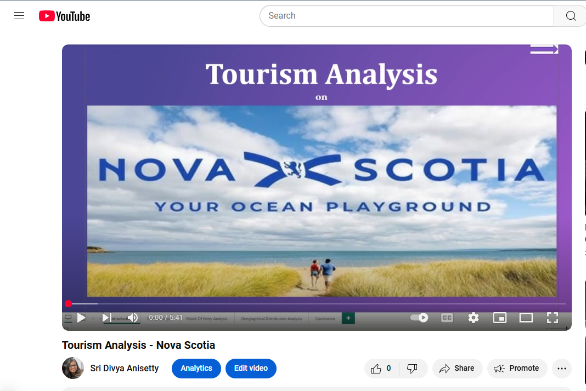

# Power-BI-Presentation
Power BI Presentation. Topic: Tourism Analysis of Nova Scotia. - [YouTube Video link](https://youtu.be/pmN-w1HFsY0) 

The raw data is collected from Government of Nova Scotia's tourism website and performed cleaning and analysis. The data is starting from 2006 to 2023. 

Analysis is mainly divided into 
1. Seasonal Analysis
2. Mode Of Entry Analysis
3. Operator Type Analysis

Source: https://data.novascotia.ca/Business-and-Industry/Tourism-Nova-Scotia-Visitation/n783-4gmh/data_preview
